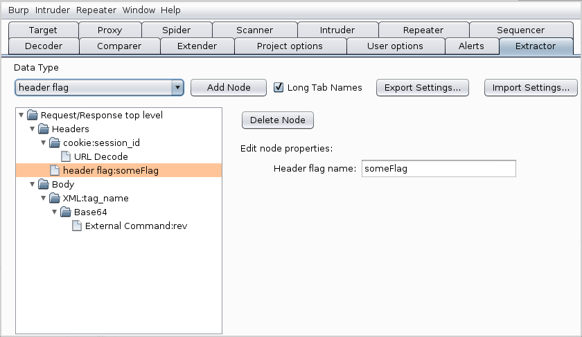
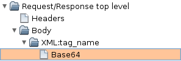

# Installation Instructions For Those That Don't Want to Compile Themselves:

1. Download Google's GSON library from Maven 
(http://central.maven.org/maven2/com/google/code/gson/gson/2.8.2/gson-2.8.2.jar)
`wget http://central.maven.org/maven2/com/google/code/gson/gson/2.8.2/gson-2.8.2.jar`

2. In Burp's *Extender/Options/Java Environment* select the folder where you 
downloaded Google's GSON library

3. Add the extension from Burp's *Extender/Extensions* tab. (the extension is 
the jar file in the *dist* folder of the repo).

# Compilation Instructions:

1. Clone the repository.

2. Save Burp's interface files to a new folder by going to Burp's tab 
*Extender/APIs* and clicking the *Save interface files* button. Then copy these 
files into the *src/burp* directory of the cloned repo.

3. Download Google's GSON library from Maven 
(http://central.maven.org/maven2/com/google/code/gson/gson/2.8.2/gson-2.8.2.jar)
`wget http://central.maven.org/maven2/com/google/code/gson/gson/2.8.2/gson-2.8.2.jar`

From the extractor directory:
4. `mkdir build`
5. `javac -cp gson-2.8.2.jar -d build src/burp/*.java`
6. `jar cf extractor.jar -C build burp`

Then load the extractor.jar file in the Extender tab of burp. (you will also 
need to point Burp's path to the folder where you stored the GSON library: Burp 
Extender > Options > Java Environment)

It should add a new tab called *Extractor* to Burp. 

# User Manual:

## Overview:

This extension adds a new tab in Burp Suite called *Extractor*

Within this tab you can add nodes to a tree to describe what the data in 
requests or responses looks like. Each Leaf in that tree will create a new tab 
everywhere a query or response is shown with the query data transformed 
according to all parent nodes up to the specific leaf.

For example, if the request's body is a XML payload with a specific tag 
containing a Base64 encoded string, the tree would look like the following:

With the above setup, every request and response now contains a tab named 
**Body>XML:tag_name>Base64** that tab should contain the Base64 decoded 
data contained in the XML tag *tag_name* of the request's body. Changing the 
data in that tab will Base64 encode the data, and inject it back in that same 
XML tag of the request's body (so that you can modify request's while 
intercepting them in Proxy/Intercept or craft payloads in Repeater).

## Node Types List:

### Base64:
No Parameter.  
This node does Base64 Decoding of the data passed to it and re-encodes it along 
the chain when you modify the data at its level or any of its child.

### Url Decode
No Parameter.  
This node does basic URL Decoding of the data passed to it, be careful that the 
data modified within this node or any of its child might look different once 
re-encoded along the chain as only invalid URL characters will be re-encoded.

### GZip
No Parameter.  
This node un-GZips the data passed to it and GZips it back if itself or any of 
it's child is modified. 

### BinToHex (Binary to Hexadecimal)
No Parameter.  
This node converts data passed to it from binary to a hexadecimal string. It 
converts back the data from hexadecimal string to binary if its data or any of 
its child data is modified.

### HexToBin (Hexadecimal to binary)
No Parameter.  
This node converts data passed to it from a hexadecimal string to binary. It 
converts back the data from binary to a hexadecimal string if its data or any 
of its child data is modified.

### Url Parameter
One Parameter:  
- URL Parameter Name: specify the name of the URL parameter to be extracted.

This node extracts data from one URL Parameter node of type 
**x-www-form-urlencoded**. It can be used directly as a **Header** child node to 
extract a URL parameter from the request's URL, or as a **body** child node if 
the body only contains URL style parameters, or as a child of any other node if 
it contains a URL or **x-www-form-urlencoded** parameters. Modified data will be 
injected back in the parameter at the same position.

### Body Parameter
Two Parameters:  
- Parameter Name: Name of the body parameter that needs to be extracted.
- Boundary String: copy in this parameter the content of the **boundary** flag 
from the request. (don't add any additional dashes here)

This node is used to extract a body parameter of type **multipart/form-data**. 
Modified data will be injected back in the parameter at the same place. 

### Cookie
One Parameter:  
- Cookie Name: the name of the cookie that needs to be processed.

This nodes extracts data from one cookie, Modified data will be injected back 
in the cookie. This node should be used a direct child of the **Header** node.

### Header Flag
One Parameter:  
- Header flag name: the name of the flag that should be extracted from the 
request.

This node extracts the content of one header flag, modified data will be 
injected back in the flag. This node should be used as a direct child of the 
**Header** node.

### XML
One Parameter:  
- XML node name: the name of the node from which to extract data.

This node extracts the value from the first XML node that matches the XML node 
name parameter. Modified data will be injected back into the value of that same 
node.

### XML Parameter
Two Parameters:  
- XML node name: the name of the node from which to extract data.
- XML node Parameter: the name of the parameter value to be extracted

This node extracts the parameter value from the first XML node that matches the 
XML node name. Modified data will be injected back into the parameter of that 
same node.

### Json
Two Parameters:  
- Name: name of the json object to extract.
- Index (optional): If the object is a table, this index will be used to know 
which part ot extract, if no index is proveded and the data is a table, the 
whole table will be extracted. If the object is not a table, leave this field 
empty.

This node extracts data from a JSON payload. Only data from the top level of 
the payload passed to it can be extracted; however you can chain this node with 
other Json nodes to extract JSON objects embedded within JSON objects.

### AND
One Parameter:  
- AND with (in hex): Hexadecimal representation of the data to AND with.

This nodes ANDs the data passed to it with the data from its parameter. The 
data passed to node should be in binary format (use a HextoBin node first if 
you need). Modified data will be ANDed back, however, please note that this 
operation has little value has the AND operator is not bijective (you can't 
expect the data injected back to make sense in its context).

### OR
One Parameter:  
- OR with (in hex): Hexadecimal representation of the data to OR with.

This nodes ORs the data passed to it with the data from its parameter.The data 
passed to node should be in binary format (use a HextoBin node first if you 
need). Modified data will be ORed back, however, please not that this operation 
has little value has the OR operator is not bijective (you can't expect the 
data injected back to make sense in its context).

### XOR
One Parameter:  
- XOR with (in hex): Hexadecimal representation of the data to XOR with.

This nodes XORs the data passed to it with the data from its parameter. The 
data passed to node should be in binary format (use a HextoBin node first if 
you need). Modified data will be XORed back.

### Identity : 
No Parameter  
This node does no processing: it just displays the data that is passed to it, 
it is mostly useful to add a control point to check if the data passed along a 
chain of nodes is correct at a specific point where the node has been inserted.

## Making your own nodes:

You have the option of crafting your own nodes in java, a sample node file has 
been provided in the code named QueryNodeXXX.java, simply copy/paste and rename 
it and follow the instructions provided within. Also remember to add your newly 
crafted node in Globals.java towards the end of the list (don't change the 
first 2 lines of that list if you don't want to break anything).

